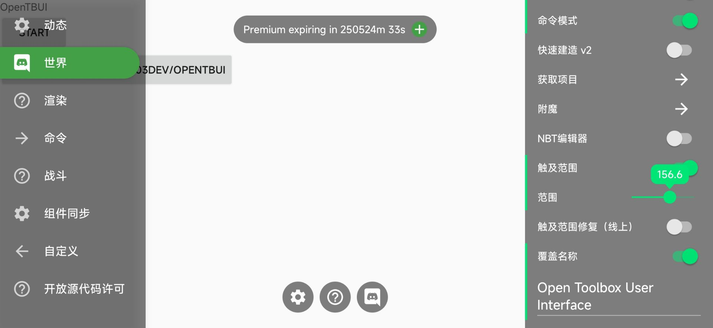

# OpenTBUI
基于 Android Java 仿制的 Toolbox for Minecraft: PE 用户界面

大部分 UI(不包含快捷悬浮窗) 都还原了  
内置一个简单的 StatusManager，可以方便地同步相同 path 的不同组件的状态，也可以监听 path 状态变化和 action 的触发  
自定义方面没有做的很完善  
支持两种悬浮窗模式: 应用内 Popup(Toolbox 就是用的这个) 和 全局悬浮窗(需要自己授予悬浮窗权限)  
  
示例: [/app](https://github.com/1503Dev/OpenTBUI/tree/main/app)  
OpenTBUI 工件: [/OpenTBUI](https://github.com/1503Dev/OpenTBUI/tree/main/OpenTBUI)  
IndicatorSeekBar 工件: [/indicatorseekbar](https://github.com/1503Dev/OpenTBUI/tree/main/indicatorseekbar)  
  
预编译的工件 aar(包括 OpenTBUI 和 IndicatorSeekBar) 和 示例 demo apk 可以在 [Release](https://github.com/1503Dev/OpenTBUI/releases) 中找到  

本项目的 IndicatorSeekBar 工件是基于 [warkiz/IndicatorSeekBar](https://github.com/warkiz/IndicatorSeekBar) 修改而来的

demo 已在 Android 8.1 和 Android 12 上测试通过

## 开放源代码许可
_不包含 IndicatorSeekBar 的依赖许可_

- OpenTBUI - [LGPLv3](LICENSE)
- IndicatorSeekBar - Apache-2.0
- AppCompat - Apache-2.0
- MaterialComponents - Apache-2.0
- AndroidX - Apache-2.0
- RecyclerView - Apache-2.0
- FlexBoxLayout - Apache-2.0

## 画廊

(自定义Overlay和额外按钮)  
